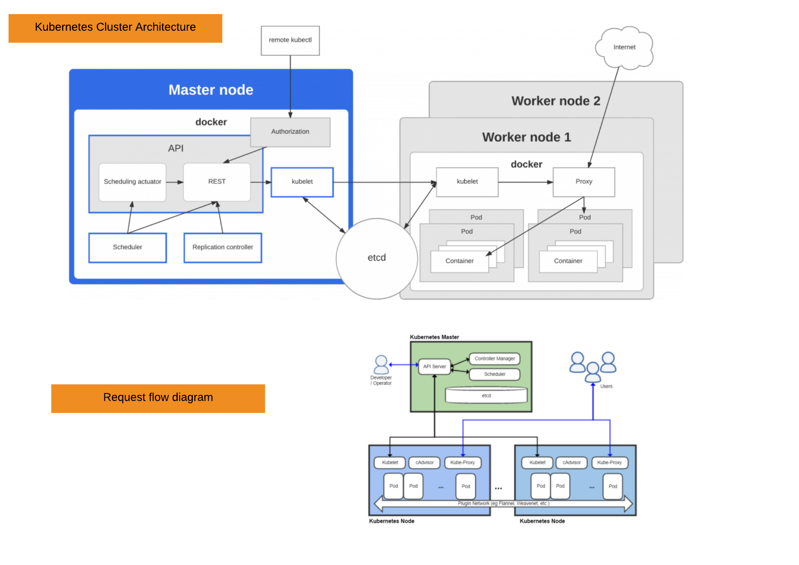
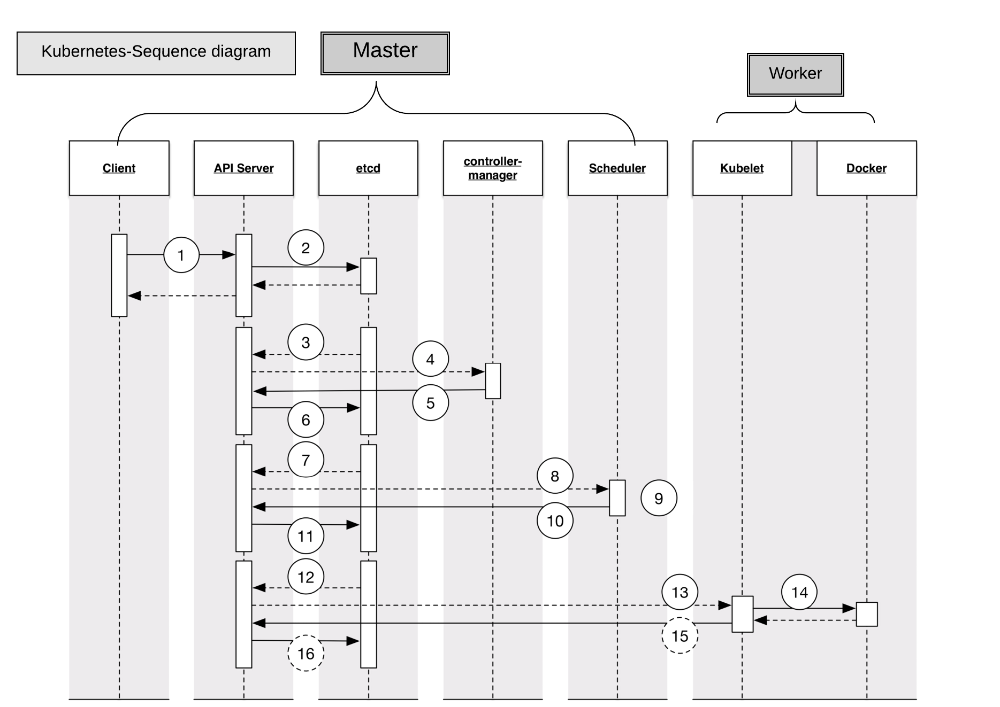

# kubernetes-cluster

Resources for deploying various Kubernetes entities, these resources are designed to be ran on the kubernetes master but can be ran anywhere.

Currently supported resources:

  * Kubernetes Master (`kube_master`)
  * Kubernetes Node (`kube_worker`)

OS Support: 

  * Supported for Centos v7+, Ubuntu 16.04, Fedora 25
  * Kubernetes 1.7 only for now. 

# Attributes

  * `['kubernetes-cluster']['localhost']` = '127.0.0.1' - This IP require for checking respective kubernetes port
  * `['kubernetes-cluster']['hostname']` = 'kubemaster' **required** - Hostname for Master node
  * `['kubernetes-cluster']['ipaddress']` = '' **required** - The private ip address of your kubernetes master. its require for worker to connect kubenetes master.
  * `['kubernetes-cluster']['user-name']` = 'centos' - This is require for master recipe. allow permission to create cron job. 
  * `['kubernetes-cluster']['kubelet']` = '10255' - Non-changeble. This used only for port verification.  
  * `['kubernetes-cluster']['kube-scheduler']` = '10251' - Non-changeble. This used only for port verification.
  * `['kubernetes-cluster']['kube-controlle']` = '10252' - Non-changeble. This used only for port verification.
  * `['kubernetes-cluster']['kube-proxy']` = '10256' - Non-changeble. This used only for port verification.
  * `['kubernetes-cluster']['kube-apiserver']` = '6443' - Non-changeble. This used only for port verification. its require for worker to connect kubenetes master
  * `['kubernetes-cluster']['etcd']` = '2380'- Non-changeble. This used only for port verification.
  * `['kubernetes-cluster']['weave-npc']` = '6781' - Non-changeble. This used only for port verification.
  * `['kubernetes-cluster']['weaver']` = '6782' - Non-changeble. This used only for port verification.
  * `['kubernetes-cluster']['k8s-version']` = '1.7' - Version of kubernetes
  * `['kubernetes-cluster']['token']` = '7de59e.b859a71e082d41a5' **required** - Provide a token after your master node ready. its require for worker to connect kubenetes master
  * `['kubernetes-cluster']['agent']` = 'master' **required** - Select setup agent [worker/master]

# Recipes

#### default
This is a default recipe. it will automatically execute respective recipe as per the if condition and parameters. 

#### kube_master_centos_1.7 (`Kube_Master`)
1. Configure master node hostname.
2. Disable selinux security. 
3. Installing all require package for kuber master. 
4. Enable and Start all require service. **Reboot after**
5. Create Kubernetes cluster.
6. Verify all respective port for kube connection. 
7. Deploy the containers needed to make a functioning Kubernetes node that can attach to a remote master. This will deploy weave and the needed kubernetes services.

Ensures the needed containers for a kubernetes master are deployed/running with proper networking setup.
Deploy the containers needed to make a functioning Kubernetes master locally on the system. This will deploy etcd, api-server, kube-scheduler, kube-controlle, and all needed kubernetes services.

#### kube_worker_centos_1.7 (`Kube_Worker`)
1. Resolving maste node hostname locally.
2. Disable selinux security. 
3. Installing all require package for kuber worker. 
4. Enable and Start all require service.
5. Joining kube-cluster using Kubeadm tool. 

Ensures the needed containers for a kubernetes node are in place and running

### Design document and Sequence diagram - 
 https://reancloud.atlassian.net/wiki/spaces/PLAT/pages/153844550/DEP-4341+Kubernetes+cluster+deploy+and+config+blueprint




#### (`.kitchen.yaml`) for Master 
```sh
---
driver:
  name: ec2
  region: us-west-2
  subnet_id: subnet-632b1404
  security_group_ids: ["sg-c421a3be"]
  aws_ssh_key_id: Kubernetes

  tags:
    Owner: nikhil.kapure
    Environment: Testing
    Project: reanassess

transport:
  ssh_key: C:\Users\OPEX\Desktop\Kubernetes.pem

verifier:
  name: inspec

platforms:
  # CentOS 7
  - name: centos-7
    driver:
      image_id: ami-0c2aba6c
      instance_type: m3.medium
      spot_price: 0.5
      tags:
        Name: kubernetes-centos-7
suites:
  - name: default
    run_list:
      - recipe[kubernetes-cluster::default]
    attributes:
      kubernetes-cluster:
        agent: master
        user-name: centos
```

#### (`.kitchen.yaml`) for Worker 
```sh
---
driver:
  name: ec2
  region: us-west-2
  subnet_id: subnet-632b1404
  security_group_ids: ["sg-c421a3be"]
  aws_ssh_key_id: Kubernetes

  tags:
    Owner: nikhil.kapure
    Environment: Testing
    Project: reanassess

transport:
  ssh_key: C:\Users\OPEX\Desktop\Kubernetes.pem

verifier:
  name: inspec

platforms:
  # CentOS 7
  - name: centos-7
    driver:
      image_id: ami-0c2aba6c
      instance_type: m3.medium
      spot_price: 0.5
      tags:
        Name: kubernetes-centos-7
suites:
  - name: default
    run_list:
      - recipe[kubernetes-cluster::default]
    attributes:
      kubernetes-cluster:
        ipaddress: 10.0.11.167
        token: 62c3b1.b709f5acc5c4ade3
        agent: worker
```

## How to verify ?

```sh
$ sudo cp /etc/kubernetes/admin.conf $HOME/
$ sudo chown $(id -u):$(id -g) $HOME/admin.conf
$ export KUBECONFIG=$HOME/admin.conf
$ kubectl get nodes

```
#### Accessing the cluster API -
You can explore the API with curl, wget, or a browser, like so:

```sh
$ curl https://<mater_node_IP>:6443/api/
{
  "kind": "APIVersions",
  "versions": [
    "v1"
  ],
  "serverAddressByClientCIDRs": [
    {
      "clientCIDR": "0.0.0.0/0",
      "serverAddress": "10.0.11.167:6443"
    }
  ]
}
```
# License and Author
* Author:: Nikhil S. Kapure (<nikhil.kapure@reancloud.com>)
